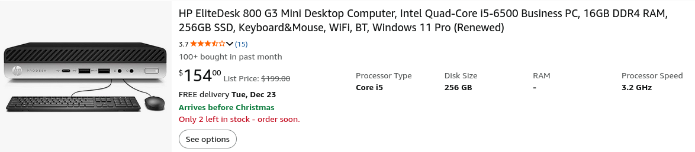
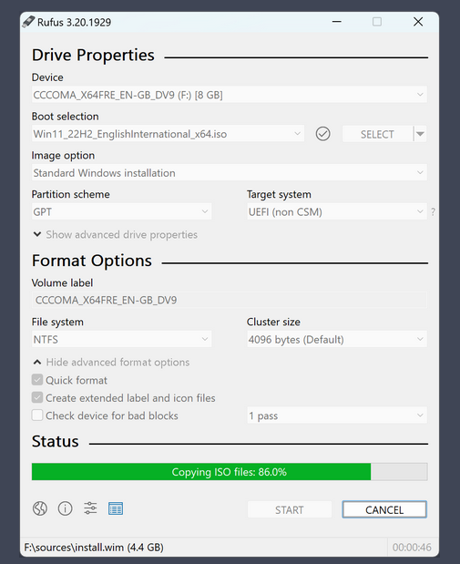
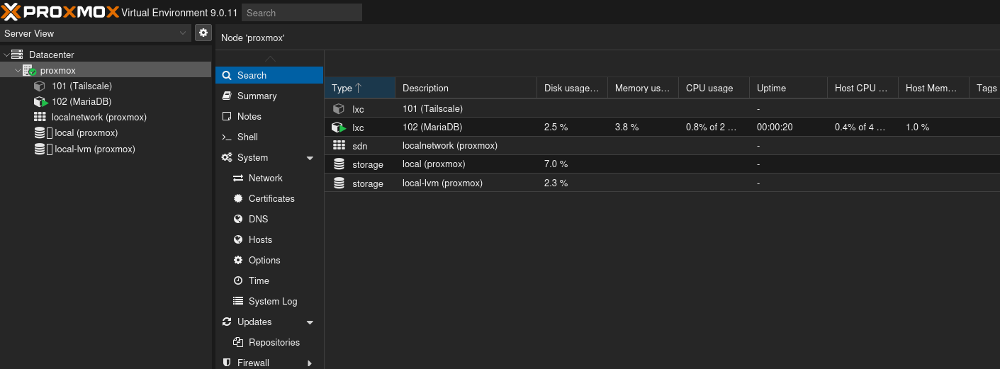
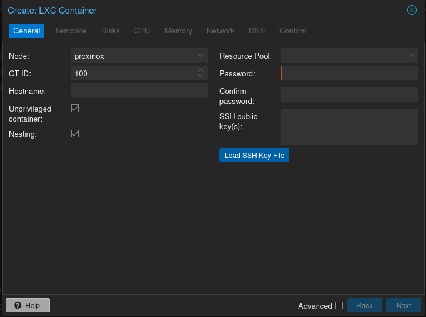
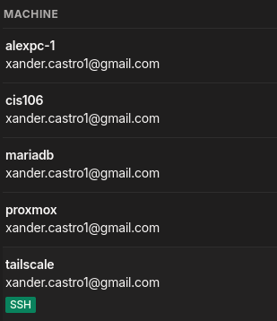

# Deliverable 1

## What is a database?
A database is a collection of data that can be stored, managed, and accessed.

## What is a Linux container?
A Linux container is a lightweight, isolated environment that runs applications using the host system’s kernel, similar to a virtual machine but with less overhead.

## What is Proxmox VE?
Proxmox VE is an open-source virtualization platform that lets you run virtual machines and containers on a server.

## What is Debian?
Debian is a open source Linux operating system known for stability.

## What is Mariadb?
Mariadb is a open source database management system used to store and manage structured data.

## What is SQL?
SQL (Structured Query Language) is a programming language used to manage and query data in relational databases like Mariadb & MySQL.

## What is a home lab?
A home lab is a personal setup where you experiment with servers, networking, virtualization, and IT tools to learn and practice skills.

## How to create your own home lab with Proxmox VE

### 1) Pick the hardware
- PC, mini PC, or old server
- Ethernet connection (Its better if you can)
- Enough RAM and storage for VMs/containers
- Extra drive for backups(Optional)

### 2) Download required tools
- Proxmox VE ISO (https://www.proxmox.com/en/downloads/proxmox-virtual-environment/iso)
- Rufus (USB installer)
- USB flash drive (8GB and up)

### 3) Create the Proxmox USB with Rufus
1. Plug in the USB drive
2. Open Rufus
3. Device: select your USB
4. Boot selection: choose the Proxmox VE ISO
5. Click Start
6. Unplug the USB when finished

### 4) Boot from the USB
1. Insert the USB into the server
2. Power on and open the Boot Menu / BIOS
3. Select the USB drive

### 5) Install Proxmox VE
1. Select Install Proxmox VE
2. Accept the license
3. Choose the installation disk
4. Set country, keyboard, and timezone, etc
5. Create a password and enter an email
6. Configure networking
   - Set a static IP 
   - Example: "192.168.1.50"
7. Complete installation and reboot
8. Remove the USB drive

### 6) Access the Proxmox web
1. open a browser (On another computer)
2. Go to https://PROXMOX_IP_HERE (Meaning the ip you gave it):8006
3. Log in as root using your password
4. 

### 7) Basic Proxmox setup
- Update the system:
  - apt update
  - apt upgrade

### 8) Create your first VM/Container
- Use containers for lightweight services
- Use VMs for full operating systems
Steps:
1. Download a Debian template (container)  or ISO (VM)
2. Create the VM/CT
3. Assign CPU, RAM, and disk
4. Start the VM/CT
5. 

### 10) Install services (MariaDB in this case)
- Install MariaDB on Debian
- Create databases and users

### 11) Extra step: Adding tailscail (Do access Server outside your network)
- Install tailscail in the server
- run the command:
'tailscale up'
- use the link given to add server to tailnet
- Add the device you want to use to connect to the tailnet
- connect using the IP address give by tailscale

### 12) Other home lab projects:
- MariaDB server
- Nextcloud personal cloud
- Email server
- Web server 
- Windows VM
