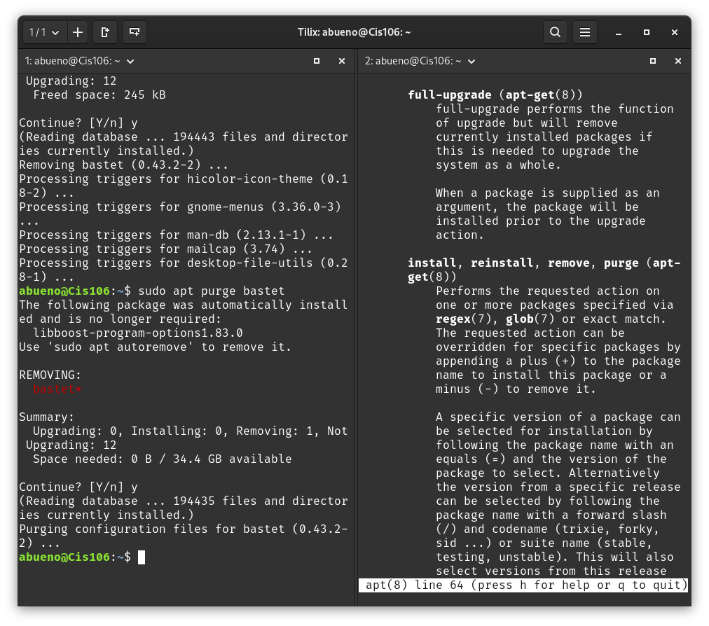
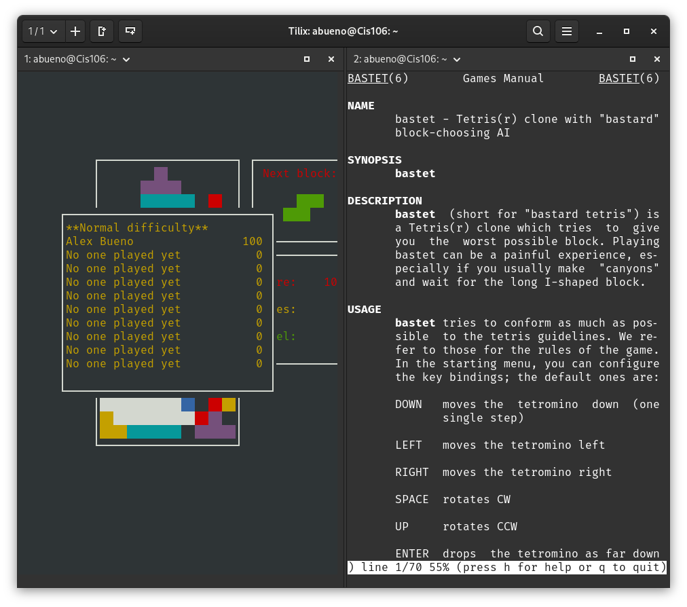
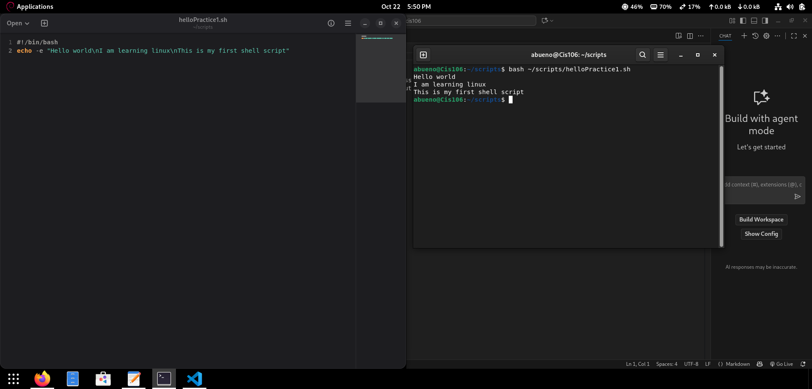
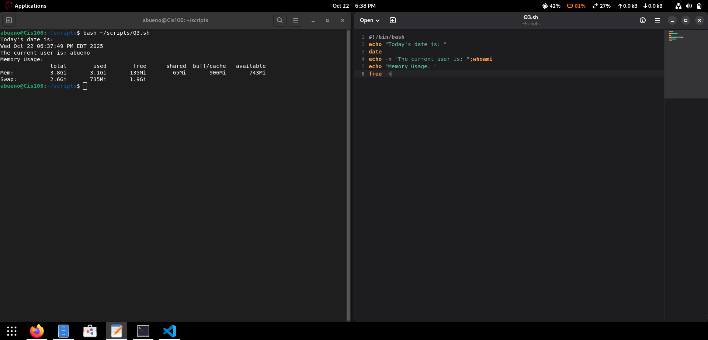

# Linux Practice 1 Report

## Managing Software (APT)

### Practice 1 done

### Tetris Install

## Shell Scripting

### Shell 1 done

### Screenshot 5: Running Script

## References

* [Notes 4](../notes/notes4.md)
* [Lab 4](../scripts)

